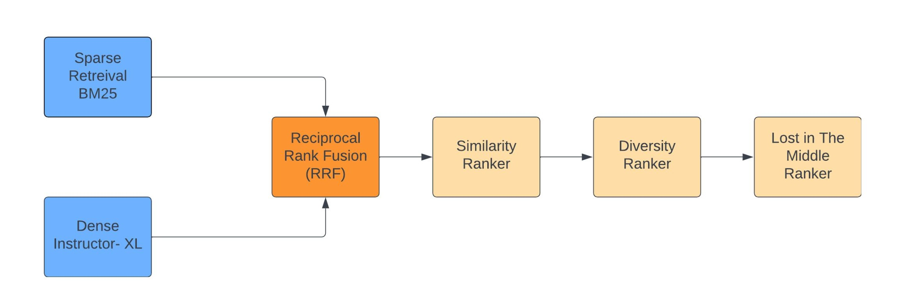

# RAG Pipelines

Retrieval Augmented Generation (RAG) is a method for generating text using additional information fetched from an external data source. Providing relevant documents to the model can greatly increase the accuracy of the generated response.

A RAG pipeline can be tuned in many ways to give more relevant answers. One important way is to improve the relevance of the retrieved context which is input to the LLM. This ensures that the generated answers are coherent and consistent with the context in the original documents.

## Performance Evaluation of Rankers and RRF Techniques for Retrieval Pipelines

Paper: [Performance Evaluation of Rankers and RRF Techniques for Retrieval Pipelines](https://github.com/avnlp/rag-pipelines/blob/main/rankers_rrf.pdf)

In the intricate world of LFQA and RAG, making the most of the LLM’s context window is paramount. Any wasted space or repetitive content limits the depth and breadth of the answers we can extract and generate. It’s a delicate balancing act to lay out the content of the context window appropriately. 

With the addition of three rankers, viz., DiversityRanker, LostInTheMiddleRanker, Similarity rankers and RRF techniques, we aim to address these challenges and improve the answers generated by the LFQA/RAG pipelines. We have done a comparative study of adding different combinations of rankers in a Retrieval pipeline and evaluated the results on four metrics, viz., Normalized Discounted Cumulative Gain (NDCG), Mean Average Precision (MAP), Recall and Precision .

The following rankers were used:

- Diversity Ranker: The Diversity Ranker enhances the diversity of the paragraphs selected for the context window.

- Lost In The Middle Ranker: The Lost In The Middle Ranker optimizes the layout of the selected documents in the LLM’s context window.

- Transformers Similarity Ranker: The Transformers Similarity Ranker ranks Documents based on how similar they are to the query. It uses a pre-trained cross-encoder model to embed both the query and the Documents. It then compares the embeddings to determine how similar they are.

In our study, we consider the following cases of retrieval:

- Dense Retrieval
- Hybrid Retrieval
- Dense + Rankers Retrieval
- Hybrid + Rankers Retrieval

To combine the results for Hybrid retrieval, Reciprocal Rank Fusion (RRF) was used.




## Installation

To install the `rag-pipelines`:
```python 
pip install git+https://github.com/avnlp/rag-pipelines.git@#egg=rag-pipelines
```

## License

The source files are distributed under the [MIT License](https://github.com/avnlp/rag-pipelines/blob/main/LICENSE).
